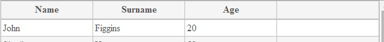
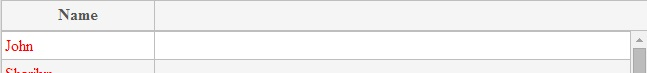
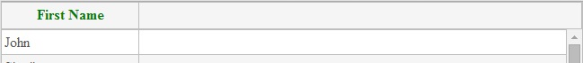
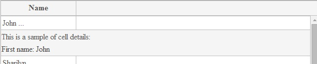


### Columns usage scenario:

First, you need  values for grid. For example, you have grid rows in JavaScript:

<!--Start the highlighter-->
<pre class="brush: js">
    var items = [
         { Name: "John", Surname: "Figgins", Age: "20", detail_Name: "First name:  John"},
         { Name: "Sharilyn", Surname: "Ham", Age: "52", detail_Name: "First name: Sharilyn"}
        //... more items
    ];
</pre>
#####
Simple columns markup in HTML:

<pre class="brush: html">
    <column data-g-member="Name">  
    </column>
    <column data-g-member="Surame">  
    </column>
    <column data-g-member="Age">  
    </column>
</pre>
#####

Result:

### Custom templates:

Grid markup with custom **cell template**:

##### For Knockout
<pre class="brush: html">
    <column data-g-member="Name">
        <cell>
                           
        </cell>
    </column>
</pre>
##### For Angular
<pre class="brush: html">
    <column data-g-member="Name">
        <cell>
           {{item.item.Name}}             
        </cell>
    </column>
</pre>
#####
Column's 'Name' values will be red. 

Result:

Column **header template**. In header can be used binding or value, you can set custom style options:

##### For Knockout and for Angular
<pre class="brush: html">
    <column data-g-member="Name">
       <header>
             First Name
        </header>
    </column>
</pre>
#####
Result:

**Cell details template**. Code below shows how toggle details on click on grid cell.

##### For Knockout
<pre class="brush: html">
    <column data-g-member="Name">
        <cell>
            ...
            <a href data-bind="click: function () { toggleDetailsForCell(0); }, clickBubble: false">...</a>
        </cell>
        <celldetail>
            

                
This is a sample of cell details: 

				<!--You can bind value from javascript items array. 
				detail_Name - is the property of item in items array.-->
                

            

        </celldetail>
    </column>
</pre>
##### For Angular
<pre class="brush: html">
    <column data-g-member="Name">
        <cell>
			{{item.item.Name}}
			<a href ng-click="item.toggleDetailsForCell(0, item, items); $event.stopPropagation();">...</a> 
		</cell>
		<celldetail>
			

				
This is a sample of cell details: 

				
{{item.item.detail_Name}}

			

		</celldetail>
    </column>
</pre>
#####
Result:

