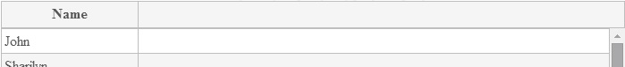

###data-g-member

Sets the property name of the item in the data source items' array, which value should be displayed in the cell in the current column.
    
**Value:** The item's property name, which value will be used for this grid column.

**Default value:** there is no default value. 	

**Example:**

In HTML:

<!--Start the highlighter-->
<pre class="brush: html">
	<column data-g-member="Name"> </column>
</pre>
##### 
 In JavaScript:

A JavaScript array of items, where the every array element is a JavaScript object with the "Name" field. 
The "Name" field value is displayed in grid row in the column where the  **data-g-member** is set to "Name"

<!--Start the highlighter-->
<pre class="brush: html">
	var items = [
        { Name: "John", Surname: "Doe", Age: "33" }
        //... more items
	];
</pre>

#####
Result:

 

