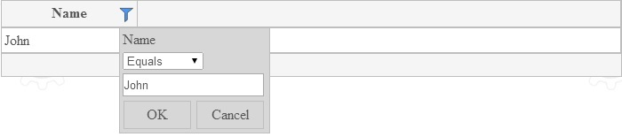

####filterPopup

**filterPopup** is for internal use. 

Type of this variable is a TesserisPro.TGrid.Template. 
Constructor of the TesserisPro.TGrid.Template accepts a HTML DOM element. 
This HTML DOM element can contain data-bindins.

To create the template use code:
<!--Start the highlighter-->
<pre class="brush: js">

var template = new TesserisPro.TGrid.Template(htmlElement);

</pre>
####

A filter popup template isn't required. There is a default filter popup template. A default filter popup template is used, if a filter popup template isn't defined.

**Example:**

#####For Knockout
Example of a grid with details settings, a details template and one column:

<pre class="brush: html">

   

</pre>
####
Javascript:
<pre class="brush:js">
var items = [
        { Name: "John", Surname: "Figgins", Age: "20", detail_Name: "First name:  John"},
        { Name: "Sharilyn", Surname: "Ham", Age: "52", detail_Name: "First name: Sharilyn"}
    //... more items
];
function vm() {
    var self = this;
    self.itemsProvider = new TesserisPro.TGrid.ArrayItemsProvider(items);
};

$(function () {
    ko.applyBindings(new vm());
});
</pre>

#####For Angular

Example of a grid with details settings, a details template and one column:
<pre class="brush: html">
	
 
        

          <t-grid id="test-angular" provider="dataProvider" enablefiltering="true">
            
          </t-grid>
        

    

</pre>

####
Javascript:
<pre class="brush:js">
  var items = [
  		{ Name: "John", Surname: "Figgins", Age: "20", detail_Name: "First name:  John"},
  		{ Name: "Sharilyn", Surname: "Ham", Age: "52", detail_Name: "First name: Sharilyn"}
  	//... more items
  ];
  var sampleModule = angular.module("SampleModule", ['TGrid'])
    .controller("ctrl", function ctrl($scope) {
        $scope.dataProvider = new TesserisPro.TGrid.ArrayItemsProvider(items);
    })
</pre>

#####

