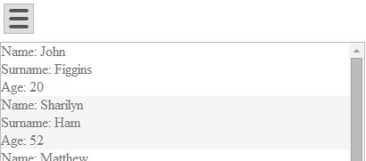
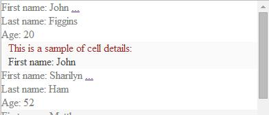

####mobileTemplateHtml

**mobileTemplateHtml** is for internal use. 

Type of this variable is TesserisPro.TGrid.Template. 
Constructor of TesserisPro.TGrid.Template accepts HTML DOM element. 
This HTML DOM element can contain data-bindins.

To create template use code:
<!--Start the highlighter-->
<pre class="brush: js">

var template = new TesserisPro.TGrid.Template(htmlElement);

</pre>
####
For simple grid you don't have to define mobile template in  HTML. 
Mobile rows are created automatically, for columns, which are defined in HTML template. 
Column definitions for mobile also are inherited from columns. 
Cell templates, header templates and cell details templates are not inherited and should be overrided in custom mobile template.  

#####For Knockout
<pre class="brush: html">

               

</pre>
#####For Angular
<pre class="brush:html">

 
    

        <t-grid provider="dataProvider" enablegrouping="true" enablecollapsing="true">
            
        </t-grid>
    

</pre>
Example of custom **mobileTemplateHtml** with template for cell details:

#####For Knockout
In HTML TGrid template part that defines **mobileTemplateHtml** is:
<pre class="brush:html">
<mobile>
	

		First name: 
		
		<a href data-bind="click: function(){toggleDetailsForCell(0);},clickBubble:false">
		...
		</a>
		 
		Last name: 
		
		 
		Age: 
		
	

</mobile>
</pre>
####
To see details you should also define cell details template. All HTML code is:
<pre class="brush:html">
    

        
    

</pre>
####
Javascript:
<pre class="brush:js">
var items = [
        { Name: "John", Surname: "Figgins", Age: "20", detail_Name: "First name:  John"},
        { Name: "Sharilyn", Surname: "Ham", Age: "52", detail_Name: "First name: Sharilyn"}
    //... more items
];
function vm() {
    var self = this;
    self.itemsProvider = new TesserisPro.TGrid.ArrayItemsProvider(items);
};

$(function () {
    ko.applyBindings(new vm());
});
</pre>
#####For Angular
In HTML TGrid template part that defines **mobileTemplateHtml** is:
<pre class="brush:html">
<mobile>
  

  	First Name: 
  	{{item.item.Name}}
  	<a href ng-click="item.toggleDetailsForCell(0,item,items);$event.stopPropagation();">
  		...
  	</a>
  	 
  	Last Name: 
  	{{item.item.Surname}}
  	 
  	Age: 
  	{{item.item.Age}}
  	 
  
       
</mobile>
</pre>
####
To see details you should also define cell details template. Full HTML code is:
<pre class="brush:html">

 
  

   <t-grid id="test-angular" provider="dataProvider" showdetailsonselection="true">
      
     </t-grid>
  

</pre>
####
Javascript:
<pre class="brush:js">
  var items = [
  		{ Name: "John", Surname: "Figgins", Age: "20", detail_Name: "First name:  John"},
  		{ Name: "Sharilyn", Surname: "Ham", Age: "52", detail_Name: "First name: Sharilyn"}
  	//... more items
  ];
  var sampleModule = angular.module("SampleModule", ['TGrid'])
    .controller("ctrl", function ctrl($scope) {
        $scope.dataProvider = new TesserisPro.TGrid.ArrayItemsProvider(items);
    })
</pre>
####

